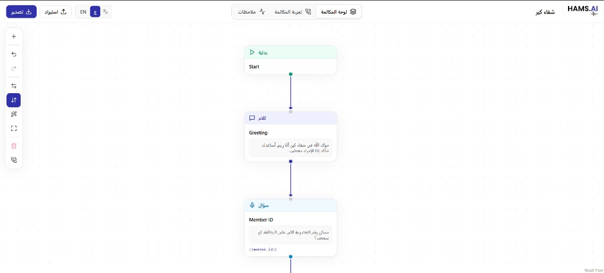
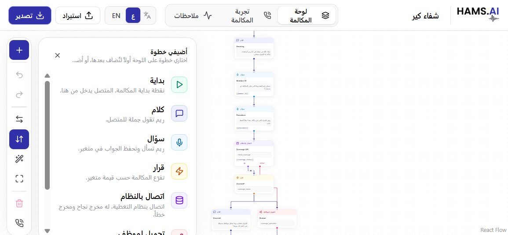
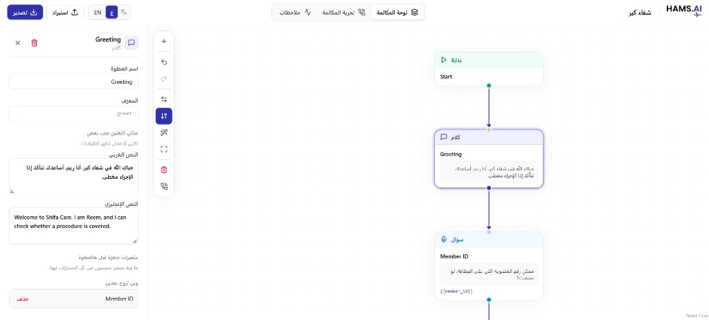
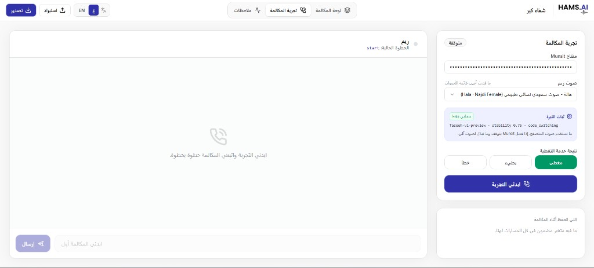
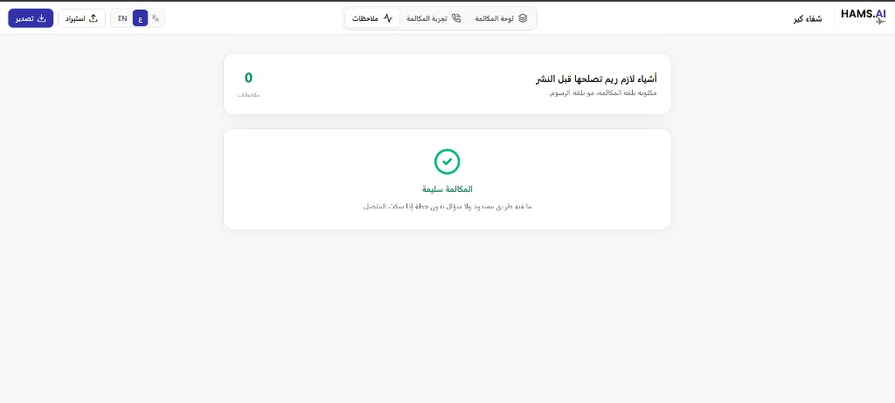
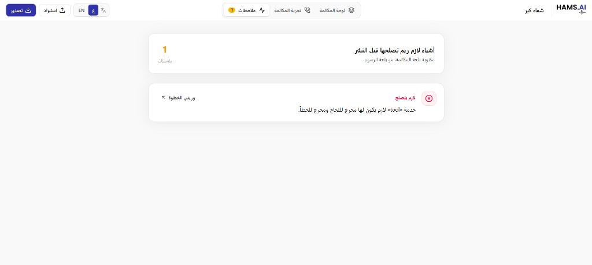

# Hams.AI Voice Flow Editor

**Demo:** https://hams-an-editor-where-non-engineers.vercel.app/

Browser editor for Shifa Care (شفاء كير). Reem designs a Hams.AI phone call on a board, checks it, and tries it with a real Munsit voice. Arabic is the default language. English is one click away, and the layout flips with the language.



| Add a step from the controls | Edit the selected step |
| --- | --- |
|  |  |

| Test call with a Munsit voice | Notes: the call is safe |
| --- | --- |
|  |  |



The call is a JSON document with `schemaVersion: 1`. Each step is a node: `start`, `say`, `ask`, `condition`, `tool`, `transfer`, or `end`. Lines between steps are edges, and a tool edge can be `ok` or `error`.

## Run

```bash
npm install
npm run dev
```

The app opens at http://localhost:5173.

| Script | What it does |
| --- | --- |
| `npm run dev` | Vite dev server on port 5173 |
| `npm run build` | Typecheck, then production build |
| `npm run preview` | Serve the production build |
| `npm run test` | Run Vitest once |
| `npm run test:watch` | Vitest in watch mode |
| `npm run typecheck` | `tsc --noEmit` |

Speech goes through the Vite proxy `/api/munsit` → `https://api.munsit.com`, so the browser never calls Munsit directly. Override the base with `VITE_MUNSIT_API_BASE`. The development key and voice list live in `src/config/munsit.ts`. The editor only speaks through Munsit cloud TTS. API reference: [Munsit docs](https://docs.munsit.com/).

## Tools

| Tool | Used for |
| --- | --- |
| React 18 + TypeScript | UI |
| Vite 6 | Dev server, build, Munsit proxy |
| Tailwind CSS 4 | Layout and the Hams.AI palette (ink `#030201`, brand `#3132a9`) |
| [@xyflow/react](https://reactflow.dev) | The board: drag, connect, select, pan, zoom |
| [radix-ui](https://www.radix-ui.com) | Tabs, tooltip, dialog, and select |
| [motion](https://motion.dev) | Step menu and details panel open and close |
| lucide-react | Icons |
| clsx | Class names on buttons |
| Vitest | Tests for the graph and the `{{variable}}` template |
| [Munsit](https://docs.munsit.com/) | Arabic voice API for the test call: synthesize with `faseeh` (`POST /text-to-speech/{model}`), list voices (`GET /voices`), and hear the caller with `munsit-en-ar` (`POST /audio/transcribe`, `WS /listen`) |

## Helpers

### Hooks — `src/hooks`

| Helper | What it does |
| --- | --- |
| `useFlowHistory` | Undo and redo. `commit` records a change. `replace` is the live drag, so undo returns to the position before the drag. |
| `useAnimatedNodes` | Glides steps to their new places (350ms) after a layout. A drag is not animated. |
| `useCallSimulator` | Walks the call: caller text, current step, variables, retries, and the mock tool result (`ok`, `error`, `slow`). |
| `useMunsitTTS` | Sends a line to Munsit and plays the audio. |
| `useMunsitSTT` | Caller voice in the test call. The mic button records one reply and sends it to `POST /audio/transcribe`. The voice-call button streams 16 kHz audio to `WS /listen` and replies when Munsit marks the end of the caller's turn. |
| `useMunsitVoices` | Loads the voice list. |
| `useLinePreview` | Plays one script line in the chosen Munsit voice. A new line cancels the one before, and lines already heard replay from memory. |
| `useLatest` | Keeps a ref of the latest value so async callbacks do not go stale. |

### Graph and files — `src/utils`

| Helper | What it does |
| --- | --- |
| `layoutFlow` | Places steps in a vertical or horizontal tree. `MAIN_GAP` is the space between rows. |
| `computeDiagnostics` | Human-language checks: missing start, many starts, unreachable, dead end, trap loop, no silence plan, ask with no variable, missing text, tool without ok/error, variable not ready on every path. |
| `getUpstreamVariables` | Variables that exist on every path into a step. `{{` suggestions use only these. |
| `createNode` / `connectNodes` / `disconnectEdge` / `removeNodes` / `updateNode` | Build and edit the flow. |
| `findNode` / `findStartNode` / `outgoing` / `incoming` | Look up steps and lines. |
| `parseFlowJson` / `downloadFlowJson` / `readFileAsText` | Import and export. An unknown `schemaVersion` is rejected. |
| `interpolateVariables` / `toPlaceholder` | Fill `{{name}}` during a test call. |
| `buildCallScript` | Turns the flow into a readable script, using the same exits as the test call. Paths that meet again are shown side by side and then rejoin. Paths that never meet keep the main one (tool `ok`, first rule) on the timeline and fold the others away. Loops and shared steps become "goes to" jumps. |

### Speech — `src/services` and `src/config`

| Helper | What it does |
| --- | --- |
| `synthesizeSpeech` | `POST` text to Munsit and return an audio blob. |
| `listVoices` | `GET` the Munsit voice catalog. |
| `MunsitApiError` | Error from a failed Munsit response. |
| `MUNSIT_MODEL` | `faseeh-v1-preview` |
| `MUNSIT_VOICE_SETTINGS` | Stability, speed, sample rate, dialect `auto`, code switching on. |

### State — `src/context`

| Helper | What it does |
| --- | --- |
| `useFlow` | The call, selection, layout direction, add/delete/connect, and undo. |
| `useSimulator` | The running test call. |
| `useVoiceSettings` | API key and chosen voice. |
| `useI18n` | `lang` (`ar` or `en`), `dir`, `t(key)`, and `setLang`. Strings are in `src/i18n/messages.ts`. |

## Screens

- **Board** (`src/components/canvas`) — steps, the control card, the add-step menu, and the details panel. The Graph / Script switch at the top swaps the map for the script.
- **Script** (`src/components/script`) — the call as a vertical timeline: lines Reem says (with a play button), system calls, and decisions whose other paths open as accordions. Click a step to edit it in the details panel.
- **Test call** (`src/components/simulator`) — type what the caller says, hear Reem, see variables.
- **Notes** (`src/components/diagnostics`) — the check list. A note can jump back to its step.

Shared controls are in `src/components/ui`: `Button`, `Select`, `Dialog`, `Tooltip`, `Field`.
